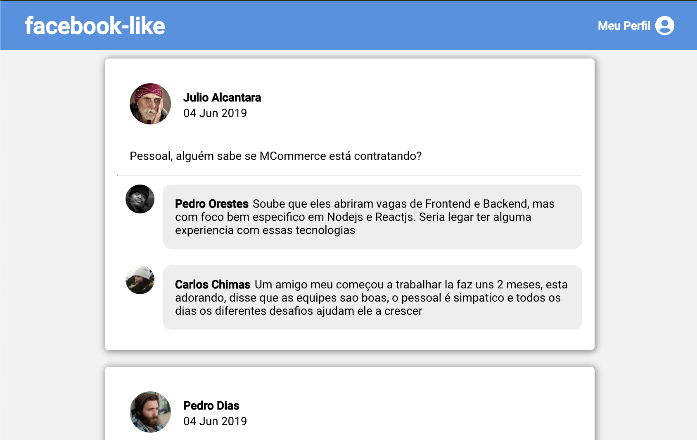

# Simple Comments Page - `facebook-like`

A simple app to test first react concepts without using the CRA



## What I've learned

- I had a good understanding of how to structure my apps with webpack setup
- I use a lot of React fundamentals for building all components

## How to test this implementation

In the project directory, you can run:

Installing with:

```sh
yarn
```

Start in development mode:

```sh
yarn dev
```

Runs the app in the development mode.<br>
Open [http://localhost:8080](http://localhost:8080) to view it in the browser.

> Warning: We are using fake data, so it's a simple static page

## Built With

- [Webpack](https://webpack.js.org) - A bundler for javascript and friends.
- [Babel](https://babeljs.io) - Javascript compiler
- [React](https://reactjs.org/) - A JavaScript library for building user interfaces

## Dependencies

### Webpack

- [webpack](https://github.com/webpack/webpack) - Module and asset bundler.
- [webpack-cli](https://github.com/webpack/webpack-cli) - Command line interface for Webpack.
- [webpack-dev-server](https://github.com/webpack/webpack-dev-server) - Development server for Webpack.

### Babel

- [@babel/core](https://www.npmjs.com/package/@babel/core) - Transpile ES6+ to backwards compatible JavaScript.
- [@babel/plugin-proposal-class-properties](https://babeljs.io/docs/en/babel-plugin-proposal-class-properties) - Use properties directly on a class.
- [@babel/preset-env](https://babeljs.io/docs/en/babel-preset-env) - Smart defaults for Babel.

### Loaders

- [babel-loader](https://webpack.js.org/loaders/babel-loader/) - Transpile files with Babel and Webpack.
- [css-loader](https://webpack.js.org/loaders/css-loader/) - Resolves CSS imports into JS.
- [style-loader](https://webpack.js.org/loaders/style-loader/) - Inject CSS into the DOM.
- [file-loader](https://webpack.js.org/loaders/file-loader/) - Copy files to build folder.

## Author

- **Marcio Mendes** - [mmendesas](https://github.com/mmendesas)

## License

This project is licensed under the MIT License - see the [LICENSE.md](LICENSE.md) file for details
